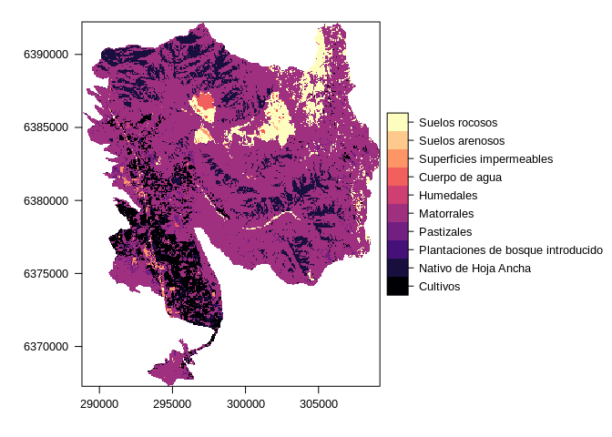

All the files for this question are in the [following
git](https://github.com/derek-corcoran-barrios/El_Soldado):

I am trying to plot a categorical map in leaflet with a categorical
legend showing a character vector as labels:

Load the packages
-----------------

first I load the required packages

    library(rgdal)
    library(raster)
    library(kableExtra)
    library(rasterVis)
    library(leaflet)

Then I load the required datasets
---------------------------------

    Codes <- readRDS("Codes.rds")
    LandCover <- readRDS("LandCover.rds")

if we look at the landcover raster it is a categorical raster that I
made with `ratify` from the raster package

    LandCover

    ## class      : RasterLayer 
    ## dimensions : 832, 680, 565760  (nrow, ncol, ncell)
    ## resolution : 30.00002, 29.99993  (x, y)
    ## extent     : 288800.8, 309200.8, 6367272, 6392231  (xmin, xmax, ymin, ymax)
    ## crs        : +proj=utm +zone=19 +south +datum=WGS84 +units=m +no_defs +ellps=WGS84 +towgs84=0,0,0 
    ## source     : memory
    ## names      : LC_CHILE_2014_b 
    ## values     : 150, 932  (min, max)
    ## attributes :
    ##         ID          names IDs
    ##  from: 150       Cultivos 150
    ##   to : 932 Suelos rocosos 932

I want to have the name attribute as the legend

which works using the `levelplot` function from the rasterVis package:

    rasterVis::levelplot(LandCover)

The data is also repited in the Codes data.frame if it works

    kable(Codes, caption = "Tabla de atributos del mapa") %>%
      kable_styling(bootstrap_options = c("striped", "hover"))

<table class="table table-striped table-hover" style="margin-left: auto; margin-right: auto;">
<caption>
Tabla de atributos del mapa
</caption>
<thead>
<tr>
<th style="text-align:right;">
Code
</th>
<th style="text-align:left;">
Selected
</th>
</tr>
</thead>
<tbody>
<tr>
<td style="text-align:right;">
150
</td>
<td style="text-align:left;">
Cultivos
</td>
</tr>
<tr>
<td style="text-align:right;">
212
</td>
<td style="text-align:left;">
Nativo de Hoja Ancha
</td>
</tr>
<tr>
<td style="text-align:right;">
251
</td>
<td style="text-align:left;">
Plantaciones de bosque introducido
</td>
</tr>
<tr>
<td style="text-align:right;">
330
</td>
<td style="text-align:left;">
Pastizales
</td>
</tr>
<tr>
<td style="text-align:right;">
450
</td>
<td style="text-align:left;">
Matorrales
</td>
</tr>
<tr>
<td style="text-align:right;">
510
</td>
<td style="text-align:left;">
Humedales
</td>
</tr>
<tr>
<td style="text-align:right;">
640
</td>
<td style="text-align:left;">
Cuerpo de agua
</td>
</tr>
<tr>
<td style="text-align:right;">
800
</td>
<td style="text-align:left;">
Superficies impermeables
</td>
</tr>
<tr>
<td style="text-align:right;">
920
</td>
<td style="text-align:left;">
Suelos arenosos
</td>
</tr>
<tr>
<td style="text-align:right;">
932
</td>
<td style="text-align:left;">
Suelos rocosos
</td>
</tr>
</tbody>
</table>
Two tests that didn’t work
--------------------------

### Test 1

    pal <- colorFactor(rainbow(10), values(LandCover),
                        na.color = "transparent")

    leaflet() %>% addTiles()  %>%  addRasterImage(LandCover, colors = pal, opacity = 0.8) %>%  addLegend(pal = pal, values = values(LandCover),title = "Land Cover", labels = Codes$Selected)

### Test 2

In this second one I thought that adding the labels attribute to the
`addLegend` function would do the trick, but it does not work

    pal <- colorFactor(rainbow(10), values(LandCover),
                        na.color = "transparent")

    leaflet() %>% addTiles()  %>%  addRasterImage(LandCover, colors = pal, opacity = 0.8) %>%  addLegend(pal = pal, values = values(LandCover),title = "Land Cover", labels = Codes$Selected)

